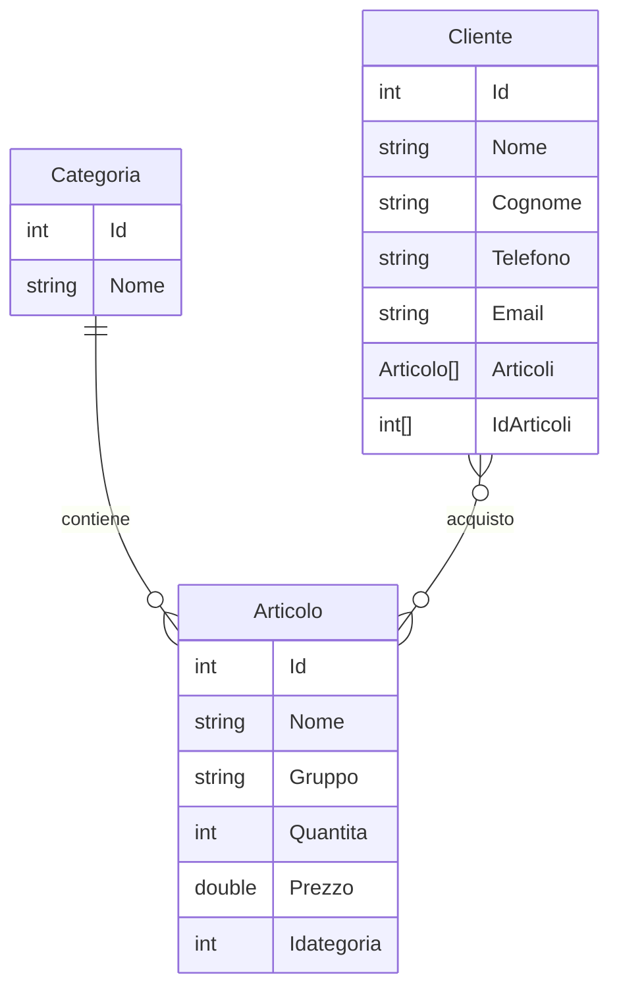

## DEFINIZIONE REQUISITI ED ANALSI

Il programma consentirà di gestire il negozio e di avere un interfaccia per il cliente

- [ ] All'inizio deve esserci un modo per riconoscere se chi entra è un cliente o un dipendente
- [x] Nel caso del dipendente, avrà la possibilità di gestire gli articoli del negozio
- [x] La gestione degli articoli deve comprendere aggiunta, visualizzazione, modifica ed eliminazione di essi
- [x] Il dipendente deve anche riuscire a gestire i clienti
- [x] La gestione dei clienti è simile agli articoli: aggiunta, visualizzazione, modifica ed eliminazione
- [x] Se è un cliente, prima deve esserci un modo per riconoscere se il cliente è già entrato precedentemente
- [x] Se il cliente non è entrato prima, verrà registrato nel database
- [x] Se invece non è la prima volta che entra, verrà riconosciuto
- [x] Il cliente potrà scegliere di cercare degli articoli (possibilmente in diversi modi), vedere la sua cronologia di acquisti e modificare alcuni dei propri dati
- [x] La ricerca dell'articolo darà l'opzione di acquistare, se il cliente lo volesse
- [ ] Il cliente non potrà acquistare un articolo se non ce né più in stock

## PIANIFICAZIONE ED ARCHITETTURA

> Ricorda, mvc è per tabella, non solo il programma in sé

- [x] Il programma applicherà il modello MVC, di conseguenza verrà diviso in almeno 3 file
- [x] Il Model si occuperà di tutte le funzionalità che vanno a modificare il database e a prendere dei dati da esso
- [x] Il View si occuperà della visualizzazione dei dati, della gestione di vari input e aiuterà visivamente con l'interfaccia
- [x] Il Controller userà le funzioni del Model e View per occuparsi principalmente dell'interfaccia, 
di conseguenza si occuperà di far funzionare a dovere il programma, creando vari menù e gestendo le azioni dell'utente
- [x] Il programma agirà su framework
- [x] Il database su cui il programma lavorerà sarà SQLite, il Model dovrà essere configurato di conseguenza
- [x] Il programma dovrà essere capace di inizializzare la tabella delle categorie in caso non rispettasse certe condizioni/non ci fosse
- [ ] Mentre il dipendente può modificare il database come vuole, se il cliente acquista qualche articolo, deve automaticamente aggiornare gli articoli scelti, togliendo 1 alla quantità, se c'è ancora almeno 1 articolo in magazzino
- [x] Il cliente sarà forzato a mettere il nome e cognome, mentre potrà scegliere se anche aggiungere un numero di telefono e/o un email
- [ ] Ci deve essere un modo di riconoscere all'inizio del programma se chi entra è uno dei dipendenti o un cliente, il programma si deve adattare di conseguenza

## DEFINIZIONI DI STRUTTURE E CONVENZIONI

- [x] I nomi delle classi, metodi e variabili delle classi devono essere in PascalCase
- [x] Aggiungere il summary dove si può nei metodi
- [x] Devono esserci le tabelle: Categorie, Articoli, Clienti
- [x] La tabella degli articoli deve contenere: Id (int), Nome specifico (string), Nome del gruppo d'appartenenza (string), Quantità (int, non minore di 0), Prezzo (double), Un collegamento alla categoria
- [x] La tabella delle categoria è predefinita: Devono esserci solo e solamente 5 categorie, ognuno con un id prestabilito
- [x] La tabella delle categorie conterrà: Id (int), Nome (string) e un collegamento ad una lista di articoli appartenenti a X categoria
- [x] La tabella dei clienti deve contenere: Id (int), Nome (string), Cognome(string), Un possibilie numero di cellulare (come più conveniente), Un possibile indirizzo email (string), Una lista di numeri dedicata agli articoli acquisiti

---
Come devono essere collegati concettualmente
---

### Riflessioni in-produzione

Il database dei clienti potrebbe cambiare in database degli utenti:

- La tabella utenti è la tabella dei clienti con anche un campo extra per identificare un dipendente dagli altri
- All'inizio verrà richiesto di verificare l'identità tramite nome e cognome (per ora)
- Il menù varia da chi ha fatto l'accesso, un utente vedrà solo il suo menù e così il dipendente
- Se vuoi, puoi anche dare la possibilità al dipendente di entrare come utente